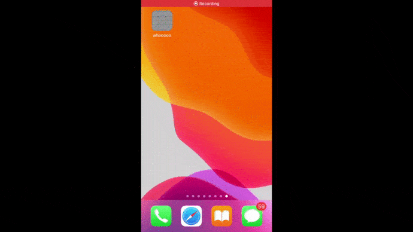

# Project Name: whooooo
 
## Work example:

  

## Description:

Приложение называется “who?” («кто из?»- англ.).  
Целью его создания является желание предоставить платформу, где каждый бы мог выразить свою точку зрения в вопросе «что же лучше?».  Предметами сравнения в принципе может быть всё что угодно, главное чтобы это было легально. 
Мы остановились на данной идее потому, что нам она показалась достаточно легко реализуемой и открытой для добавления каких-либо новых фишек.  Но всё оказалось не так радужно.  
Также опорной точкой в выборе идеи стало то, что наша команда состоит из Android и iOS разработчиков.  Это подкрепило потребность в том, чтобы идея оставалась простой. 
iOS часть была написана на языке Swift, Android - на языке Kotlin.  В качестве сервиса авторизации пользователей и базы данных был выбран Firebase, так как он достаточно прост в использовании и предлагает функционал для обеих платформ. 

## Technologies

CoreData, FireBase, Swift 5.x, Networking and etc.

## Installation:

1. Скачать Git-репозиторий  
2. Установить на устройство под управление iOS 11.0+ с помощью xCode

## Additional information

Developer contact - https://www.linkedin.com/in/роман-харченко-0506971a2/  
